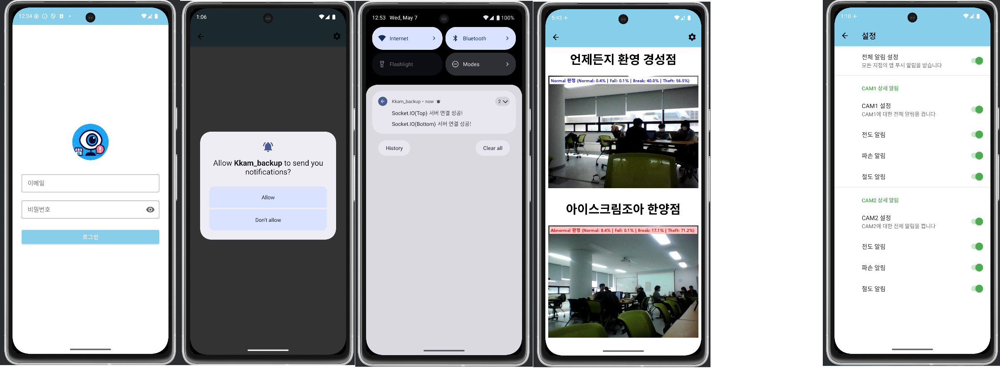

## KKAM_Android


## 개요
무인 CCTV 영상을 실시간으로 분석하여 이상 행동(정상, 전도, 절도, 파손)을 탐지하는 Android 애플리케이션입니다. 

## 주요 기능
- **로그인 화면**
  - 이메일, 비밀번호 로그인 
- **메인 페이지**
  - 실시간 영상 스트리밍  
- **이상 행동 검출**  
  - 정상  
  - 전도
  - 절도
  - 파손  
- **알림 전송**
  - 알림 발생 조건
  - 푸시 알림 또는 소리 알림 전송 
- **로컬 및 원격 설정 관리**  
  - 사용자 환경설정 항목

##  프로젝트 구조

```plaintext
.
├── android/
│   ├── app/
│   │   ├── src/
│   │   │   ├── main/
│   │   │   │   ├── java/com/example/kkam_backend/
│   │   │   │   │   ├── ui/
│   │   │   │   │   │   └── MainActivity.kt         # 화면 진입점
│   │   │   │   │   └── util/
│   │   │   │   │       └── NotificationHelper.kt   # 알림 관리 유틸
│   │   │   │   └── res/
│   │   │   │       ├── layout/                      # XML 레이아웃
│   │   │   │       ├── drawable/
│   │   │   │       └── raw/
│   │   │   │           └── alert_sound.mp3         # 경고음 파일
│   │   │   └── assets/                              # TFLite 모델 등
│   │   └── build.gradle.kts    
│   └── settings.gradle.kts     
├── gradle/                     
├── .gitignore                  
├── build.gradle.kts            
├── gradle.properties           
├── gradlew / gradlew.bat       
└── tree.txt                    


## 기술 스택
- 언어, 프레임워크 : Kotlin
- 라이브러리 : Socket.IO (네트워크), Engine.IOWebSocket 트랜스포트 (이미지 로딩), Andriod Notification Channel/API(알림), MediaPlayer (사운드 재생)


<p align="center">
  
  
</p>
